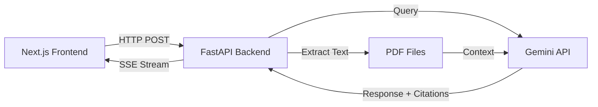

# AI Search Chat with PDF Citation Viewer

A Perplexity-style AI chat interface that provides intelligent answers with PDF citations. Built with Next.js, FastAPI, and Google Gemini AI.


## Features

✨ **Real-time AI Streaming** - Responses stream in real-time with typing effect  
📄 **PDF Citations** - Clickable citations that open PDF viewer with highlighted sections  
🔍 **Document Search** - AI searches through uploaded PDFs to find relevant information  
🎯 **Tool Call Visualization** - See AI reasoning steps as it processes your query  
🎨 **Modern UI** - Clean, Perplexity-inspired design with smooth animations  
📱 **Responsive** - Works on desktop, tablet, and mobile devices

## Architecture



**Flow:**
1. User sends query via chat interface
2. Frontend sends POST request to `/api/chat`
3. Backend creates job and returns job ID
4. Frontend establishes SSE connection to `/api/stream/{job_id}`
5. Backend loads PDF content and sends to Gemini API
6. Gemini streams response with citations
7. Backend parses citations and emits events (text, citations, sources)
8. Frontend renders streaming response with clickable citations
9. User clicks citation → PDF viewer opens with highlighted section

## Tech Stack

### Frontend
- **Next.js 16** - React framework with App Router
- **TypeScript** - Type-safe development
- **Tailwind CSS v4** - Utility-first styling
- **Zustand** - Lightweight state management
- **TanStack Query** - Data fetching and caching
- **Framer Motion** - Smooth animations
- **react-pdf** - PDF rendering

### Backend
- **FastAPI** - Modern Python web framework
- **Google Gemini 1.5 Flash** - AI model for responses
- **pdfplumber** - PDF text extraction
- **SSE-Starlette** - Server-Sent Events support
- **Pydantic** - Data validation

## Setup Instructions

### Prerequisites
- Node.js 18+ and npm
- Python 3.11+
- Google Gemini API key ([Get one here](https://makersuite.google.com/app/apikey))

### Backend Setup

1. **Navigate to backend directory:**
   ```bash
   cd backend
   ```

2. **Create virtual environment:**
   ```bash
   python -m venv venv
   source venv/bin/activate  # On Windows: venv\Scripts\activate
   ```

3. **Install dependencies:**
   ```bash
   pip install -r requirements.txt
   ```

4. **Set up environment variables:**
   ```bash
   cp .env.example .env
   ```
   
   Edit `.env` and add your Gemini API key:
   ```
   GEMINI_API_KEY=your_actual_api_key_here
   ```

5. **Add sample PDFs:**
   - Place your PDF files in `backend/sample_pdfs/` directory
   - Name them descriptively (e.g., `machine_learning.pdf`, `python_guide.pdf`)
   - The system will automatically detect and use all PDFs in this directory

6. **Run the server:**
   ```bash
   python server.py
   ```
   
   Backend will be available at `http://localhost:8080`

### Frontend Setup

1. **Navigate to frontend directory:**
   ```bash
   cd frontend
   ```

2. **Install dependencies:**
   ```bash
   npm install
   ```

3. **Run development server:**
   ```bash
   npm run dev
   ```
   
   Frontend will be available at `http://localhost:3000`

### Quick Start (Both Servers)

From the project root:

```bash
# Terminal 1 - Backend
cd backend
source venv/bin/activate
python server.py

# Terminal 2 - Frontend
cd frontend
npm run dev
```

Then open `http://localhost:3000` in your browser.

## Environment Variables

### Backend (.env)
| Variable | Description | Required |
|----------|-------------|----------|
| `GEMINI_API_KEY` | Google Gemini API key | Yes |

### Frontend (.env.local)
| Variable | Description | Default |
|----------|-------------|---------|
| `NEXT_PUBLIC_API_URL` | Backend API URL | `http://localhost:8080` |

## API Documentation

### POST `/api/chat`
Create a new chat request.

**Request:**
```json
{
  "query": "What is machine learning?",
  "conversationId": "optional-conversation-id"
}
```

**Response:**
```json
{
  "jobId": "uuid-job-id",
  "conversationId": "conversation-id"
}
```

### GET `/api/stream/{job_id}`
Server-Sent Events endpoint for streaming responses.

**Events:**
- `text` - Text chunks from AI response
- `citation` - Citation metadata
- `source` - Source card information
- `tool_call` - AI reasoning steps
- `done` - Stream complete
- `error` - Error occurred

### GET `/api/pdf/{document_id}`
Serve PDF file.

**Response:** PDF file (application/pdf)

### GET `/api/documents`
List all available PDF documents.

**Response:**
```json
{
  "documents": [
    {
      "id": "machine_learning",
      "title": "Machine Learning"
    }
  ]
}
```

## Project Structure

```
task-sam/
├── frontend/
│   ├── src/
│   │   ├── app/                 # Next.js app router
│   │   ├── components/
│   │   │   ├── chat/           # Chat UI components
│   │   │   ├── pdf/            # PDF viewer
│   │   │   └── ui/             # Reusable UI components
│   │   ├── hooks/              # Custom React hooks
│   │   ├── lib/                # Utilities and API client
│   │   ├── store/              # Zustand stores
│   │   └── types/              # TypeScript types
│   ├── package.json
│   └── tsconfig.json
│
├── backend/
│   ├── server.py               # FastAPI application
│   ├── models.py               # Pydantic models
│   ├── gemini_client.py        # Gemini API integration
│   ├── pdf_processor.py        # PDF text extraction
│   ├── queue_manager.py        # Job queue management
│   ├── sample_pdfs/            # PDF documents directory
│   ├── requirements.txt
│   └── .env.example
│
└── README.md
```

## Libraries Used

### Frontend
| Library | Version | Purpose |
|---------|---------|---------|
| next | 16.1.0 | React framework with App Router |
| react | 19.2.3 | UI library |
| framer-motion | Latest | Animations and transitions |
| react-pdf | Latest | PDF rendering |
| zustand | Latest | State management (lightweight alternative to Redux) |
| @tanstack/react-query | Latest | Data fetching and SSE handling |
| tailwindcss | 4.x | Utility-first CSS framework |

**Why these choices:**
- **Zustand** over Redux: Simpler API, less boilerplate, perfect for this use case
- **TanStack Query**: Best-in-class data fetching with built-in caching
- **Framer Motion**: Industry standard for React animations
- **react-pdf**: Most mature PDF viewer for React

### Backend
| Library | Version | Purpose |
|---------|---------|---------|
| fastapi | Latest | Modern async Python web framework |
| google-generativeai | Latest | Official Gemini SDK |
| pdfplumber | Latest | Better text extraction than PyPDF2 |
| sse-starlette | Latest | Server-Sent Events support |
| uvicorn | Latest | ASGI server |

**Why these choices:**
- **FastAPI**: Async support, automatic OpenAPI docs, excellent performance
- **pdfplumber**: More accurate text extraction with layout preservation
- **In-memory queue**: Simpler than Redis/Celery for demo purposes

## Design Decisions

### 1. **Gemini API Integration**
- Using **Gemini 1.5 Flash** for fast responses (vs Pro for better quality)
- **RAG approach**: PDF content embedded in prompt context
- **Citation extraction**: Parse `[1]`, `[2]` markers from Gemini response
- **Token limit**: First 10,000 chars per PDF to avoid context limits

### 2. **Streaming Protocol**
- **SSE over WebSockets**: Simpler, unidirectional, auto-reconnect
- **Event types**: Separate events for text, citations, tool calls, sources
- **Job-based**: Create job first, then stream via job ID

### 3. **PDF Handling**
- **Server-side processing**: Extract text on backend, send to Gemini
- **Client-side rendering**: Use react-pdf for viewer
- **Simplified highlighting**: Page-based (not coordinate-based) for MVP

### 4. **State Management**
- **Zustand stores**: Separate stores for chat and PDF state
- **No persistence**: Chat history cleared on refresh (can add localStorage)

### 5. **Trade-offs**
- ❌ **No real-time highlighting**: Would need PDF.js text layer parsing
- ❌ **No generative UI**: Time constraint (can add charts/tables later)
- ❌ **In-memory queue**: Not production-ready (use Redis for scale)
- ✅ **Simple citation matching**: Regex-based (vs NLP-based)

## Development

### Run Tests
```bash
# Frontend
cd frontend
npm run build  # Verify TypeScript compilation

# Backend
cd backend
python -m pytest  # (if tests added)
```

### Build for Production
```bash
# Frontend
cd frontend
npm run build
npm start

# Backend
cd backend
uvicorn server:app --host 0.0.0.0 --port 8080
```

## Troubleshooting

### Backend Issues

**"GEMINI_API_KEY environment variable not set"**
- Make sure you created `.env` file in `backend/` directory
- Verify the API key is correct

**"No PDF documents available"**
- Add PDF files to `backend/sample_pdfs/` directory
- Ensure files have `.pdf` extension

**"Module not found" errors**
- Activate virtual environment: `source venv/bin/activate`
- Reinstall dependencies: `pip install -r requirements.txt`

### Frontend Issues

**"Cannot find module" errors**
- Delete `node_modules` and reinstall: `rm -rf node_modules && npm install`

**PDF viewer not loading**
- Check browser console for CORS errors
- Verify backend is running on port 8080

**Streaming not working**
- Check Network tab for SSE connection
- Verify backend `/api/stream/{job_id}` endpoint is accessible

## Future Enhancements

- [ ] Add user authentication
- [ ] Persist chat history to database
- [ ] Support multiple file formats (DOCX, TXT, etc.)
- [ ] Advanced PDF highlighting with coordinates
- [ ] Generative UI components (charts, tables)
- [ ] Dark mode toggle
- [ ] PDF text search
- [ ] Export chat conversations
- [ ] Multi-language support

## License

MIT

## Credits

Built as a take-home assignment demonstrating:
- Modern full-stack development
- AI integration with streaming
- Real-time UI updates
- Clean architecture and code quality

---

**Note:** This is a demonstration project. For production use, add proper error handling, authentication, rate limiting, and use a production-ready queue system (Redis/Celery).
